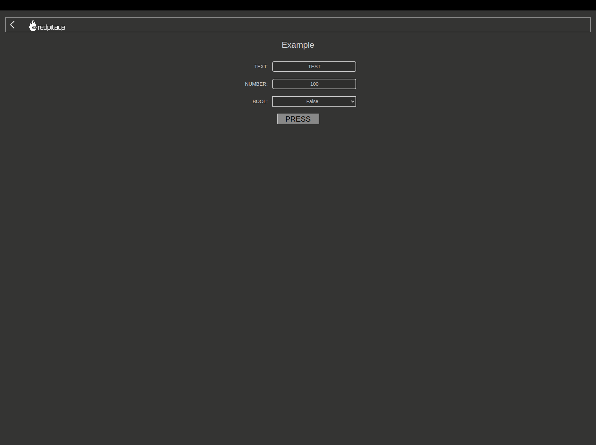

# rp-web-app-example-os3

A working port of Red Pitaya's [Complete Web App Example](https://downloads.redpitaya.com/doc/Examples/RP_WEB_app_example_2.0.zip) (originally written against the OS 2.0 SDK) to **Red Pitaya OS 3.00-57**, running on a **STEMlab 125-10 (V1r1)**.

The stock example fails to compile as-is against the OS 3.00 SDK, and even once it builds and deploys, one of its headline features (the "array data transmission" signal demo) silently doesn't work. This repo contains the patched, fully-working source, plus a full write-up of every issue hit and how each was diagnosed and fixed — see [`docs/FINDINGS.md`](docs/FINDINGS.md).



## Hardware / software under test

| | |
|---|---|
| Board | Red Pitaya STEMlab 125-10 (V1r1) |
| Hostname | `rp-f0733a.local` |
| OS | Red Pitaya OS `3.00-e00665135` (Build 57) |
| U-Boot | `redpitaya-v2026.1` |
| Linux kernel | `Release_2026.1` |
| RAM | 206 MiB (no swap by default) |
| SD card | 7.5 GB (`/boot` ~1 GB, `/` ~6.6 GB) |

## Repo layout

```
app/            Patched example application (deploy this to the board)
docs/FINDINGS.md  Full investigation log: every issue hit and how it was fixed
CONTRIBUTING.md   How to contribute
```

## What was fixed vs. the stock example

1. `src/Makefile`: `-std=c++11` → `-std=c++20` (the OS 3.00 SDK headers require `if constexpr`, `std::is_same_v`, and `std::span`).
2. `src/main.cpp`: removed the `extern "C" { #include "rpApp.h" }` wrapper — `rpApp.h` now transitively pulls in `<functional>`/`<vector>`, and C++ templates cannot have C linkage.
3. Deploy directory must be named `example` (matching `js/sm.js`'s hardcoded `app_id`), not an arbitrary name — otherwise the app UI loads but fails to launch with `Error: -1`.
4. `js/sm.js`: signal messages (the array/random-number demo) are framed with a 4-byte `"EZIA"` magic prefix before a gzip body; `pako.inflate()` on the raw frame fails and the message is silently dropped. Fixed by retrying after skipping the 4-byte prefix — this feature was completely non-functional before the fix, not just noisy.
5. `index.html`: removed a `<script src="js/analytics-main.js">` reference to a file that was never included in the official zip (harmless 404).

Full detail, including the exact compiler errors and raw WebSocket frame bytes, is in [`docs/FINDINGS.md`](docs/FINDINGS.md). The app has been verified working end-to-end in-browser: launches, connects over WebSocket, round-trips `TEXT`/`NUMBER`/`BOOL` parameters, and streams the signal-array demo correctly — with a clean console.

## Build

Building on-device requires temporary swap — the board's 206 MiB of RAM is not enough for the compiler to get through the C++20 STL headers (`cc1plus` gets OOM-killed otherwise). See [`docs/FINDINGS.md`](docs/FINDINGS.md#6-out-of-memory-during-compilation) for the full explanation.

```sh
# On the Red Pitaya, over SSH:

# 1. /opt/redpitaya is mounted read-only by default — remount it read-write
mount -o remount,rw /opt/redpitaya

# 2. Add temporary swap (206 MiB RAM is not enough to compile the C++20 headers)
fallocate -l 512M /root/swapfile
chmod 600 /root/swapfile
mkswap /root/swapfile
swapon /root/swapfile

# 3. Build
cd /opt/redpitaya/www/apps/example
make INSTALL_DIR=/opt/redpitaya

# 4. Remove the temporary swap
swapoff /root/swapfile
rm -f /root/swapfile

# 5. Restore /opt/redpitaya to read-only
mount -o remount,ro /opt/redpitaya
```

The result is `app/controllerhf.so`.

## Deploy

Copy the `app/` directory to `/opt/redpitaya/www/apps/example` on the board (remember `/opt/redpitaya` is read-only — remount `rw` first, as above), build per the steps above, then open `http://rp-f0733a.local/` (or your board's hostname/IP) — the app appears in the application list as **Example**.

The deploy directory name **must** be `example`, matching the `app_id` hardcoded in `app/js/sm.js` — the backend launcher resolves the app by that id, not by whatever directory its static assets are served from. Deploying under a different folder name breaks app launch with `Error: -1` even though the UI itself loads fine; see [`docs/FINDINGS.md`](docs/FINDINGS.md#8-deploy-directory-name-must-match-the-apps-hardcoded-app_id).

Note: modern OpenSSH's `scp` defaults to the SFTP subsystem, which this board's minimal `sshd` doesn't provide. Use legacy protocol mode explicitly:

```sh
scp -O -r app/ root@rp-f0733a.local:/opt/redpitaya/www/apps/example
```

## Credentials

Default SSH/web login for an unconfigured board: `root` / `root`. Per Red Pitaya's docs, on RAM-disk-backed images changing the password with `passwd` only lasts until the next reboot — the filesystem resets on every power cycle.

## License

MIT — see [`LICENSE`](LICENSE). Note that `app/` originated as Red Pitaya's own [Complete Web App Example](https://downloads.redpitaya.com/doc/Examples/RP_WEB_app_example_2.0.zip), which ships with no license of its own; this repo's MIT license applies to the patches, fixes, documentation, and tooling added here on top of it.
